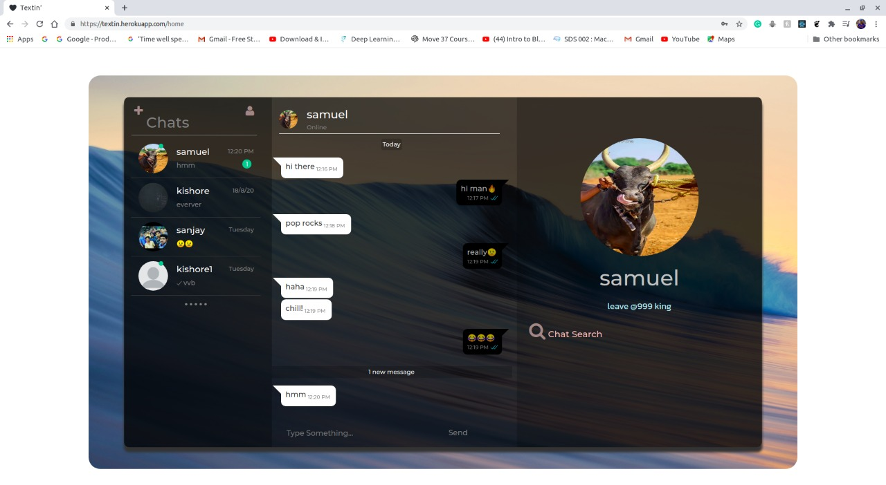

# [Textin' 🖤 - React Chat app](https://textin.herokuapp.com/)



> This is a chat app built on ⚛️.

---

### Table of Contents

- [app site 🖤 ](https://textin.herokuapp.com/)
- [Description](#description)
- [How To Use](#how-to-use)
- [References](#developers)

---

## Description

Chat app 🥷 which is a web-based application 🖥️, supports the viewport of any device, that its responsive property is trained to adapt in mobile and tab. Near to mobile apps looks-wise📱.

- This the first built, only supports one-one convo 🧡.
- The chat convo is updated and tracked in your own cloud .☁️
- No storage constraint.🔥📁
- Chat search based on word and date.📅


#### Technologies

- Client side 
    - classic web tech☕
    - react Js ❄️
    - Firebase [storage bucket]
            
- Server side
    - node js 📜 express server
    - socketio 🔌 for connection
- MongoDb

[Back To The Top](#read-me-template)

---

## How To Use
### Development 
- Hosted client and server separately, After cloning
- Add the mongo uri string in server.js (/textin-backend)
- In react context (src/contexts/userContext.js), add the socket path respectively
- firebase config needs to be added in (src/firebase/index.js) 
#### Installation
- react development server
    ```html
        cd chatappV1 && npm i    
    ```
     after installing the node modules
    ```html
        npm dev          
    ```

- express server
    ```html
        cd textin-backend && npm i    
    ```

   after installing the node modules
    ```html
        node server.js  
    ```
[Back To The Top](#read-me-template)

---

## Developers
####  Contact . further ideas and queries 🎤   
 - ✨ [Venkat Kishore](https://github.com/vk22121999)
 - 😁 [Sanjay](https://github.com/SanjaySkDoss)

[Back To The Top](#read-me-template)


